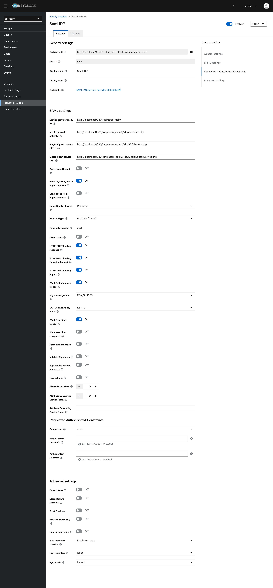
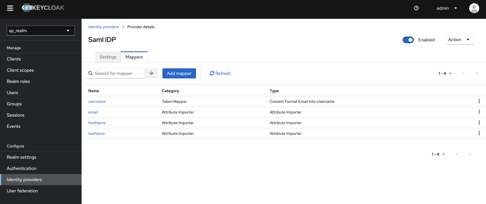
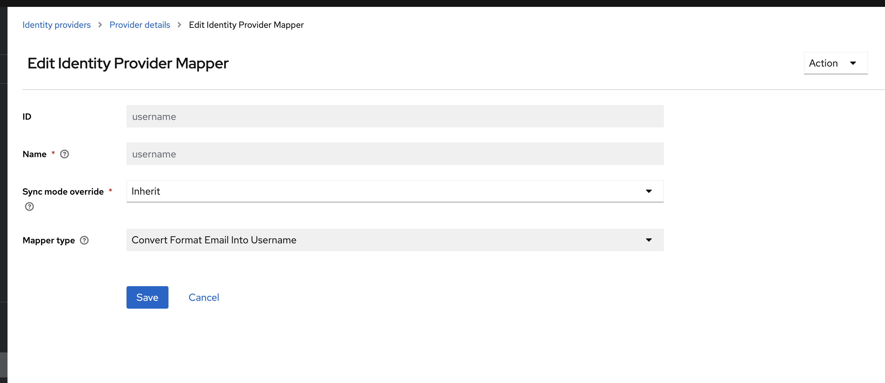

# Email to Username Mapper

This project is a Keycloak Identity Provider Mapper that converts the email address to a username by replacing '@' with '__'. It is specifically designed to modify the username of users who log in through a SAML type Identity Provider (IdP). The project is implemented in Java and uses Maven for dependency management.

## Table of Contents

- [Prerequisites](#prerequisites)
- [Building the Project](#building-the-project)
- [Deploying to Keycloak](#deploying-to-keycloak)
- [Using the Mapper in Keycloak](#using-the-mapper-in-keycloak)
- [Deploying Keycloak with Docker](#deploying-keycloak-with-docker)
- [Configuring a SAML Identity Provider](#configuring-a-saml-identity-provider)
- [Using the Mapper with a SAML Identity Provider](#using-the-mapper-with-a-saml-identity-provider)

## Prerequisites

- Java 17
- Maven
- Keycloak Server

## Building the Project

1. Clone the repository to your local machine.
2. Navigate to the project directory.
3. Run the following command to build the project:

```bash
mvn clean install
```

This will generate a JAR file in the `target` directory. This JAR file contains the mapper that will be used to modify the username of users logging in via a SAML type IdP.

## Deploying Keycloak with Docker

This project includes a `docker-compose/keycloak.yml` file that can be used to deploy Keycloak with Docker. Here are the steps to do so:
1. Copy the generated JAR file to the `docker-compose/` directory.
```bash
cp target/email-to-username-mapper-1.0.jar ./docker-compose/
```
2. Ensure you have Docker and Docker Compose installed on your machine.
3. Navigate to the directory containing the `docker-compose/keycloak.yml` file.
4. Run the following command to start the Docker services:

```bash
docker-compose -f docker-compose/keycloak.yml up
```

This will start Keycloak and a PostgreSQL database in Docker containers. Keycloak will be available at `http://localhost:9080`.

### Configuring a SAML Identity Provider

To configure a SAML identity provider in Keycloak, follow these steps:

1. Log in to the Keycloak admin console.
2. Navigate to your realm and then to Identity Providers.
3. Click on `Add provider` and select `SAML v2.0`.
4. Fill out the form with the details of your SAML identity provider.
   
5. Click `Save`.
## Using the Mapper with a SAML Identity Provider

Once you have set up your SAML identity provider, you can add the mapper to this identity provider by following the steps described in the "Using the Mapper in Keycloak" section of this `README.md` file.

Remember that, when a user logs in via the configured SAML identity provider, their email will be converted into a username format by replacing '@' with '__'. This allows for a consistent username format across different identity providers.

### Using the Mapper in Keycloak
1. Log in to the Keycloak admin console.
2. Navigate to your realm and then to Identity Providers.
3. Click on the identity provider you want to add the mapper to.
   
4. Click on the `Mappers` tab and then `Create`.
   
5. Fill in the form with the following details:
   - Name: Any name you prefer
   - Mapper Type: Token Mapper
   - ID: email-to-username-mapper
6. Click `Save`.